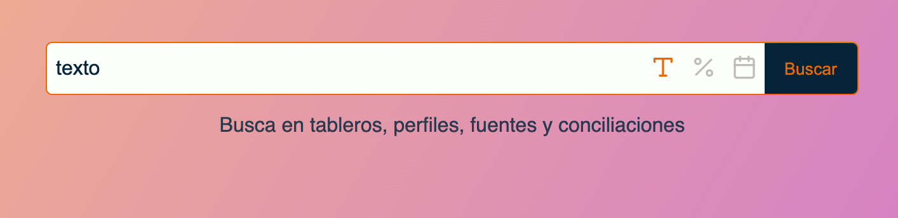

# React Searching Data

Esta aplicacion en react esta diseñada para buscar informacion sobre una extensa lista de datos.

## Buscador

Puedes seleccionar el tipo de datos por el que quieres buscar haciendo click en los iconos


Puedes buscar usando cadenas de texto



Tambien buscando sobre datos de numericos


y tambien fechas en formato **yyyy-mm-dd**


## Resultados

La informacion que haga match con la busqueda se muestra en una columna , dependiendo de la categoria a la que pertenece y quedara resaltada.


## Live DEMO

La aplicacion se encuentra funcionando aqui [LIVE DEMO](https://react-filter.vercel.app)

## Posibles mejoras

- Incluir un nuevo tipo de buscador por expresiones regex

- Tener un datePicker para que al incluir la fecha sea mas sencillo.

- Incluir logica para que el buscador (numero y fechas) no solo buscara por el match exacto , sino tambien por fechas o numero mayores o menores.

## Cuestionario

¿Por qué no debería usar la librería ​JQuery,​ ​si estoy usando ​ReactJS​?

> Primero, es una mala practica ya que en el desarrollo actual se puede realizar muchas funcionalidades de jQuery con vanilla JS y la con la libreria React.

> El desarrollo de aplicacion hechas en react son creadas a partir de un paradigma de programacion reactivo en el que Jquery no se integra con este paradigma.

> Por ultimo el performance, ya que se estarian cargando en el navegador 2 librerias para la gestion de la UI.

¿Porque usarias ​Hooks d​e las nuevas versiones de ​ReactJS, ​en lugar de ​class component​?

> En el proceso de transpilacion con Babel, un componente funcional con hooks se transpilaria en menos lineas de codigo que un componente de tipo Clase. esto hace que el boundle final de la aplicacion sea menos pesado ayudando al performace en general de la aplicacion.

> Otra razon es la facilidad de poder reutilizar logica en diferentes componentes con los CustomHooks.

> Tambien la legibilidad del codigo, ya que se separa mucho mejor la logica del componente y su render.

¿Que es un archivo ​JSX?​

> Es una extension de archivos creada para facilitar el desarrollo de aplicaciones hechas en React

¿Que diferencia hay entre una ​function ​y una ​arrow function​ de Javascript?

> La diferencia principal es su forma de ser escritas , ya que las funciones siempre se declaran de la palabra reservada _function_ mientras que las arrow no y su sintaxis es diferente.

> Las arrow function tienen contexto, asi que dentro de estas no se crea un "THIS".

> Las funciones tiene un comportamiento llamado Hoisting, en el proceso de compilado , las funciones y las variables son movidas al inicio de las declaraciones. , las arrow function no sufren de este comportaamiento.

¿Qué es ​Redux​ y​ cómo nos ayuda en los proyectos?

> Redux es una libreria de Javascript que nos facilita el manejo y control del estado de una aplicacion. Cuando una aplicacion es robusta el majedo del estado puede volverse complicado muy facil, redux nos ayuda a manejar el estado y asi evitar bugs o compotamientos inesperados.

¿Por qué usuarios pruebas unitarias en tu código?

> Las pruebas unitarias son importantes debido a que probamos las pequeñas piezas que componeen nuestra aplicacion, esto garantiza un nivel de calidad y permite que se puedan poner a prueba trozos mas grandes de codigo ( como pruebas E2E).

> Tambien ayuda al equipo de desarrollo , cuando alguien nuevo ingresa y si no hay documentacion , puede revisar las pruebas y tener un mejor contexto del funcionamiento del codigo.

¿Que nos permite hacer la siguiente declaración?

```javascript
const ​anyFunction = (​param_1​) => (​param_2​) =>​ ​param_1 ​+​ ​param_2
```

Permite crear un callback que es llamado inmediatamente.
